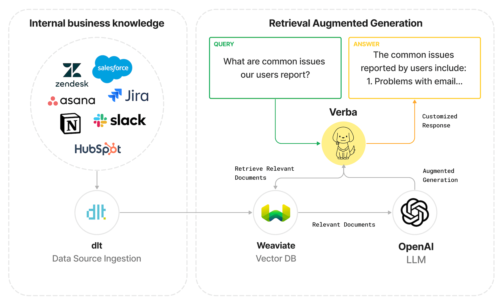

# Import Zendesk Support Tickets' Data into Verba

This is a demo project to show how to import data from the Zendesk Support API into the [Verba](https://github.com/weaviate/Verba) chatbot using the [dlt](https://github.com/dlt-hub/dlt) Python library. With this data pipeline, you can build a Retrieval-Augmented Generation (RAG) chatbot that can answer questions about your Zendesk Support tickets.

For an extensive step-by-step guide on using this repository, see [Talk to your Zendesk tickets with Weaviate’s Verba and dlt: A Step by Step Guide](https://dlthub.com/docs/blog/verba-dlt-zendesk) blog post.

The diagram above illustrates the process:
1. The data ingestion pipeline loads Zendesk Support tickets using the [Zendesk dlt source](https://dlthub.com/docs/dlt-ecosystem/verified-sources/zendesk).
2. The data is being loaded into the Weaviate database instance which also powers the Verba chatbot.
3. The user asks a question to the Verba chatbot and receives a response generated by an LLM. To generate a response the LLM receives the original questions and relevant documents retrieved from Weaviate.

## Key components

- [dlt (data load tool)](https://github.com/dlt-hub/dlt) is an open-source Python library that simplifies the process of loading data from various sources.
- [Weaviate](https://weaviate.io/) is an open-source, AI-native vector database that allows you to store and search objects based on their semantic meaning.
- [Verba](https://github.com/weaviate/Verba) is an open-source chatbot powered by Weaviate. It's built on top of Weaviate's state-of-the-art Generative Search technology. Verba includes a web interface and a query engine that uses Weaviate database.

## Data pipeline

[zendesk_verba.py](zendesk_verba.py) is a Python script that defines a data pipeline that loads tickets data from Zendesk Support to Verba.

## How to run the pipeline

1. Clone this repository.
2. Create a Python virtual environment with `python -m venv venv` and activate it with `source venv/bin/activate`.
3. Install the dependencies with `pip install -r requirements.txt`.
4. Set up the credentials for [Weaviate Cloud Services](https://console.weaviate.cloud/) and for Zendesk API in the `.dlt/secrets.toml` file.
5. Run the pipeline script with `python zendesk_verba.py`.

## Learn more

- [Importing Ticket Data from Zendesk API to Weaviate](https://dlthub.com/docs/walkthroughs/zendesk-weaviate) walkthrough is a lower-level guide that explains how to use the Zendesk dlt source with Weaviate.
- [Weaviate dlt destination](https://dlthub.com/docs/dlt-ecosystem/destinations/weaviate) is a detailed documentation of features and configuration options of the dlt destination.
- [dlt documentation](https://dlthub.com/docs/) is a comprehensive manual for the dlt library.
